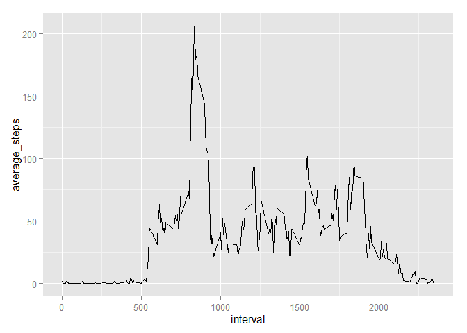

# Reproducible Research: Peer Assessment 1


## Loading and preprocessing the data
First we need to unzip then load the data into a dataframe. Since we are working from a github repository it is safe to assume the zip file exists.

```r
unzip("activity.zip")
activity <- read.csv("activity.csv", header = TRUE)  
```

## What is mean total number of steps taken per day?
Now let's look at the skewness of our step counts.

```r
library(ggplot2)
qplot(x=steps,data=activity,geom="bar")
```

 

```r
mean_steps <- mean(activity$steps, na.rm=TRUE)
median_steps <- median(activity$steps, na.rm=TRUE)
```
It looks like our subjects have a few periods of activity, but tend to be inactive. The take an average of 37.3825996 steps daily, and their median step count is 0.

## What is the average daily activity pattern?

```r
library(dplyr)
```

```
## 
## Attaching package: 'dplyr'
## 
## The following object is masked from 'package:stats':
## 
##     filter
## 
## The following objects are masked from 'package:base':
## 
##     intersect, setdiff, setequal, union
```

```r
pattern <- activity %>% group_by(interval) %>% summarise(average_steps=mean(steps,na.rm=TRUE))
ggplot(data=pattern,aes(x=interval,y=average_steps)) + geom_line()
```

 

It looks like our subjects are most active around mid-day.
## Imputing missing values
Perhaps the missing records is affecting our results. Let's replace our NA values with the total average steps and compare with our previous results.

```r
sum(is.na(activity$steps))
```

```
## [1] 2304
```

```r
activity2 <- activity
activity2$steps[is.na(activity2$steps)]<-mean(activity2$steps,na.rm=TRUE)

pattern <- activity2 %>% group_by(interval) %>% summarise(average_steps=mean(steps,na.rm=TRUE))
ggplot(data=pattern,aes(x=interval,y=average_steps)) + geom_line()
```

 

```r
mean_steps2 <-mean(activity$steps, na.rm=TRUE)
median_steps2<-median(activity$steps, na.rm=TRUE)
```
After our adjustments our subjects took 37.3825996 steps daily, with a median of 0.

## Are there differences in activity patterns between weekdays and weekends?
To answer this question we need to first separate our weedays and weekends. We'll define and leverage a function called daysOrEnd to accomplish this.

```r
library(lubridate)
dayOrEnd <- function(date){
  day_number <- wday(ymd(date))
  if(day_number == 1 | day_number == 7){
    day_type <- "weekend"
    }    
  else{
    day_type <- "weekday"
  } 
  day_type
  }

activity2$day_type <- as.factor(sapply(activity$date,dayOrEnd))
```
Now let's look at the activity patterns separated by weekdays and weekends.

```r
pattern <- activity2 %>% group_by(day_type,interval) %>% summarise(avg_steps=mean(steps))
ggplot(pattern,aes(x=interval,y=avg_steps))+geom_line()+facet_grid(day_type~.)
```

 

It looks on the weekends our subjects tend spread their steps out more.
